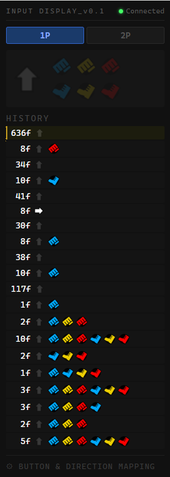

# SF3 Input Display

A browser-based input display for Street Fighter III 3rd Strike. Shows your joystick inputs in real time with history.

## Requirements

- Chrome browser
- Any gamepad / arcade stick supported by your OS

## How to Use

1. Download the ZIP and extract
2. Open `index.html` with Chrome
3. Plug in your joystick and press any button

## Features

- Real-time direction + button display
- Input history (last 20 entries)
- 1P / 2P layout toggle
- Custom button mapping (click a button name, then press the stick)
- Custom direction mapping (supports standard stick and Hat Switch)
- Settings saved automatically in browser

## Button Mapping

Open **BUTTON & DIRECTION MAPPING** at the bottom of the page. Click a button name, then press the corresponding button on your stick.

## License

MIT
